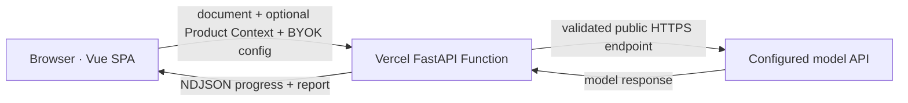

# Architecture

## Product intent

The application lets a user review a PRD with their own model account. The deployment must not own a shared model key, retain documents, or depend on a long-lived process.

## Runtime boundary

- `frontend/dist` is static and globally cached by Vercel.
- `api/index.py` exposes the FastAPI application as one Fluid Compute function.
- The function parses Markdown/DOCX bytes in memory and creates no upload file. PDF text extraction and candidate-page rendering happen in the browser, so raw PDF bytes do not reach Vercel.
- Up to four candidate page images receive one call through a separately configurable vision model. Validated nodes and edges are converted to Mermaid deterministically and reused by all six review-model calls.
- Six dimension tasks run concurrently. Each model output is validated independently.
- An optional five-source Product Context Pack is validated, serialized as a distinct untrusted JSON block, and shared by all six reviewers. It is never merged into the PRD evidence namespace.
- Report aggregation, weighting, issue IDs, and recommendation thresholds are deterministic Python logic.
- The browser keeps the report, local issue status, and chat history in memory. API format, Base URL, review model, vision model, preset, API Key, and Product Context are persisted in plaintext `localStorage` by explicit product design.

## Trust boundaries

1. The PRD and Key leave the browser and transit the Vercel Function.
2. The function resolves the configured host, rejects non-public addresses, and sends them only to a public HTTPS 443 endpoint without following redirects.
3. The Key is opaque, never interpolated into URLs, never returned, and never included in an error.
4. PRD and Product Context content are marked as untrusted data in model system prompts. The model receives no tools.
5. Quoted evidence is checked against its declared source (`prd` or one of five context IDs); unverifiable quotes are removed.
6. A self-hosted deployment is required when a user cannot trust the Vercel deployment operator.

## State and storage

There is no database, server session, object storage, queue, report share, cookie, login, or analytics integration. Instance recycling therefore cannot lose server-owned user state because none exists. Refreshing the page clears the report and chat, while the user's model configuration remains in browser `localStorage` until it is cleared from the API settings page or site data.

The former share endpoint was removed: a seven-day link cannot be implemented honestly without durable storage. Users can export Markdown locally. A future share feature must add an explicit datastore, expiry enforcement, deletion policy, and access model.

## External systems

The application makes outbound calls only to the user-configured endpoint after validation. DNS validation reduces SSRF risk but cannot fully eliminate DNS rebinding without a pinned resolver/transport. It has no email, notification, webhook, cron, payment, or background automation integration.

## Failure strategy

- Invalid document/configuration: reject before streaming with HTTP 422.
- Provider authentication, credit, model, rate-limit, or availability errors: map to stable Chinese messages; a short provider message is retained for otherwise-generic 4xx errors and scrubbed of the submitted Key.
- Network timeout: retry once.
- Invalid reviewer JSON: ask the model to repair once.
- One dimension still fails: emit a degraded dimension event and finish an explicitly degraded report.
- Client navigation/close: abort the streaming request.
